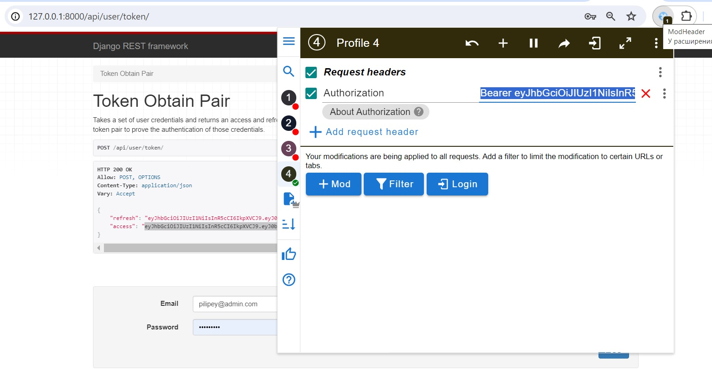
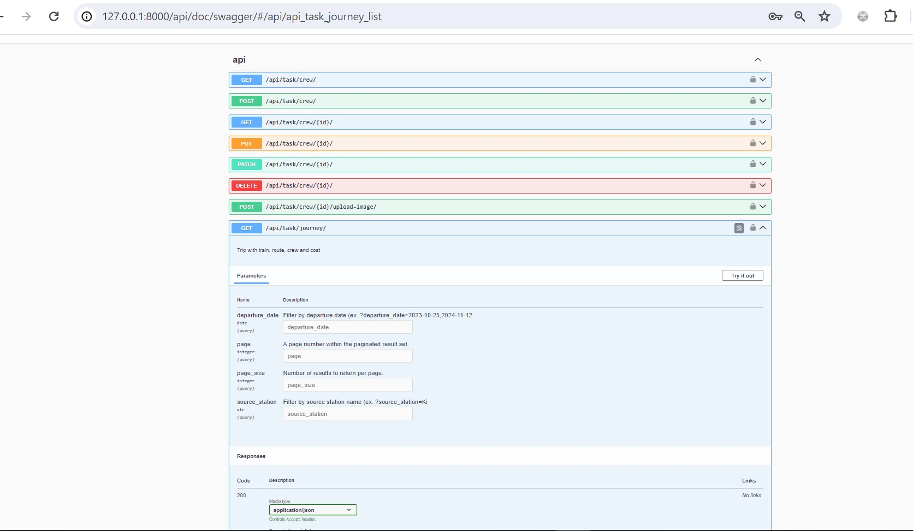
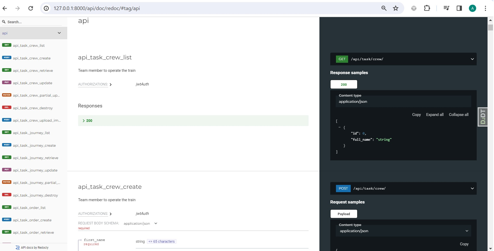

# <center >Train Station</center>
This service will give you the opportunity to select the route, departure time, find the cities and train departure date you need and create an order with the tickets you need. The administrator can also add new routes, trains, stations, crew (for crew there is an option to upload a photo of the employee).

---
           

## <center >Manual Build</center>
1. In Pycharm, open the folder where the project will be stored.
2. Cloning the project.  
    ```shell
    git clone https://github.com/AnatoliyPilipey/TrainStationWithPriceTrip.git
    ```
3. Go to the folder with the project.  
    ```shell 
    cd TrainStationWithPriceTrip
    ```
4. Creating a virtual environment.  
    ```shell 
    python -m venv venv
    ```
5. Activating the virtual environment.  
    * For Apple 
    ```shell     
    source env/bin/activate
    ```
    * For Windows  
    ```shell 
    venv\Scripts\activate
    ```
6. Install the required modules from the specified list.  
    ```shell 
    pip install -r requirements.txt
    ```
7. Create an .env file and put the secret key in it.  
    ```shell 
    DJANGO_SECRET_KEY = django-insecure-rg25$!$6=9odv+q&&hzbf^(tz%$y)whfu)ynd47g9+%f6s#l*s
    PERMISSIONS_STATUS = on
    ```
8. Perform database creation migrations.  
    ```shell 
    python manage.py migrate
    ```
9. Using the fixture with test data, we fill the database.  
    ```shell 
    python manage.py loaddata db.json
    ```
10. Disabling authentication. Specify in the .env
    ```shell 
    PERMISSIONS_STATUS = off
    ```
11. To use JWT authentication.  
    Specify in the .env
    ```shell 
    PERMISSIONS_STATUS = on
    ```  
    Run server
    ```shell 
    python manage.py runserver
    ```  
    Token Obtain Pair
    ```shell 
    http://127.0.0.1:8000/api/user/token/
    ```  
    Use next login & password
    ```shell 
    pilipey@admin.com
    ```  
    ```shell 
    adminpassword
    ```
      
    Use ModHeader by specifying 
    ```shell 
    Bearer you_access_Token_time_life_30_min
    ```  
    
12. Running the server  
    ```shell 
    python manage.py runserver
    ```
13. At this point, the app runs at  
    ```shell 
    http://127.0.0.1:8000/api/task/
    ```
14. Register new User  
    ```shell 
    http://127.0.0.1:8000/api/user/create/
    ```
15. Swagger  
    ```shell 
    http://127.0.0.1:8000/api/doc/swagger/
    ```
    
16. Redoc
    ```shell 
    http://127.0.0.1:8000/api/doc/redoc/
    ```
    

#### Note  
Set PERMISSIONS_STATUS = on when you run the python manage.py test

_Thank you for familiarizing yourself with my work._
